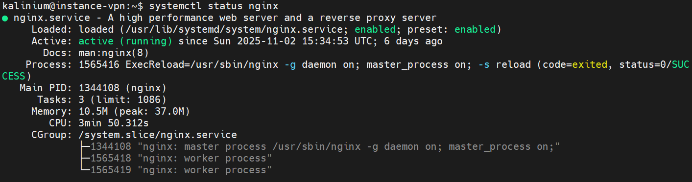

# ⚙️ 2. Installation et configuration de Nginx, PHP et MariaDB

## 2.1. Installation des dépendances

On commence par installer le serveur web **Nginx**, le moteur PHP et la base de données **MariaDB**.  
On ajoute également `unzip` pour extraire les fichiers WordPress plus tard.

```bash
# Met à jour les dépôts et installe les paquets nécessaires
sudo apt install nginx php8.3-fpm php8.3-mysql mariadb-server unzip -y
```


**💡 Bonnes pratiques :**

Ne jamais exécuter de commandes avec `sudo` sans être sûr de leur provenance.  
Garder le système à jour via `sudo apt update && sudo apt upgrade -y` avant toute installation.  
Utiliser des versions `récentes et stables` de PHP pour profiter des dernières corrections de sécurité.

## 2.2. Configuration de Nginx
Création du répertoire du site web et attribution des permissions adéquates à l’utilisateur du serveur web.

```bash
# Crée le dossier du site s’il n’existe pas
sudo mkdir -p /var/www/monsite

# Attribue les droits à l'utilisateur 'www-data' (utilisé par Nginx)
sudo chown -R www-data:www-data /var/www/monsite
```


**⚙️ Rappel de sécurité :**   
Les permissions doivent être strictes sur `/var/www/` pour éviter toute modification non autorisée.  

Vous pouvez vérifier les permissions avec :

```bash
sudo chmod -R 755 /var/www/monsite
🔧 Création du fichier de configuration du site
```

```bash
# Crée un fichier de configuration Nginx
sudo nano /etc/nginx/sites-available/monsite
```

Collez la configuration suivante :

```bash
server {
    listen 80;
    server_name _; # Le tiret bas permet d’écouter toutes les IP/Domaines
    root /var/www/monsite;
    index index.php index.html;

    location / {
        try_files $uri $uri/ /index.php?$args;
    }

    location ~ \.php$ {
        include snippets/fastcgi-php.conf;
        fastcgi_pass unix:/var/run/php/php8.3-fpm.sock;
    }

    location ~ /\.ht {
        deny all;
    }
}
```

<br>



**🚀 Activation de la configuration**  

```bash
# Active le site en créant un lien symbolique
sudo ln -s /etc/nginx/sites-available/monsite /etc/nginx/sites-enabled/

# Teste la configuration Nginx avant redémarrage
sudo nginx -t

# Recharge Nginx pour appliquer les changements
sudo systemctl reload nginx
```
<br> 

## 2.3. Sécurisation de MariaDB

```bash
# Lance l'assistant de sécurisation intégré à MariaDB
sudo mysql_secure_installation
```
<br> 

Cet outil interactif permet de :

* Définir un mot de passe root fort,  
* Supprimer les utilisateurs anonymes,  
* Interdire les connexions root à distance,  
* Supprimer la base de test,  
* Appliquer les changements de privilèges immédiatement.  

<br> 

**💡 Recommandations :**

Utiliser un mot de passe complexe (majuscule, minuscule, chiffres et symboles).  
Désactiver l’accès root à distance pour éviter les attaques par force brute.

## 2.4. Création d’une base de données WordPress
Connexion au serveur MariaDB :

```bash
sudo mysql -u root -p
Ensuite, exécuter les commandes SQL suivantes :

sql
Copiar código
-- Crée une base de données nommée 'wordpress'
CREATE DATABASE wordpress;

-- Crée un utilisateur 'wp_user' avec un mot de passe fort
CREATE USER 'wp_user'@'localhost' IDENTIFIED BY 'mot_de_passe';

-- Accorde tous les privilèges sur la base de données WordPress
GRANT ALL PRIVILEGES ON wordpress.* TO 'wp_user'@'localhost';

-- Recharge les privilèges
FLUSH PRIVILEGES;

-- Quitte MariaDB
EXIT;
```


### ⚠️ Important :

> Ne pas utiliser root pour les connexions applicatives.  

> Chaque projet doit avoir son propre utilisateur avec des droits limités.  

> Pensez à sauvegarder la base de données régulièrement (ex : mysqldump).  

<br>

## 🧱 2.5. Sécurisation complémentaire du serveur
Pour renforcer la sécurité du serveur hébergeant Nginx et MariaDB :

**🔒 Désactiver le login root SSH :**

```bash
sudo nano /etc/ssh/sshd_config
# Modifier ou ajouter :
PermitRootLogin no
```

Puis recharger SSH :
```bash
sudo systemctl reload ssh
```

🧩 Installer Fail2ban pour bloquer les IP suspectes :

```bash
sudo apt install fail2ban -y
sudo systemctl enable fail2ban
sudo systemctl start fail2ban
```

🧯 Vérifier les services actifs :

```bash
sudo ss -tuln
```

### Mettre en place des mises à jour automatiques :

```bash
sudo apt install unattended-upgrades
sudo dpkg-reconfigure --priority=low unattended-upgrades
```

<br>


✅ Résultat attendu :
À ce stade, le serveur dispose :

- d’un environnement LEMP (Linux, Nginx, MariaDB, PHP),  
- d’un pare-feu de base,  
- d’une configuration sécurisée et prête à accueillir WordPress.  