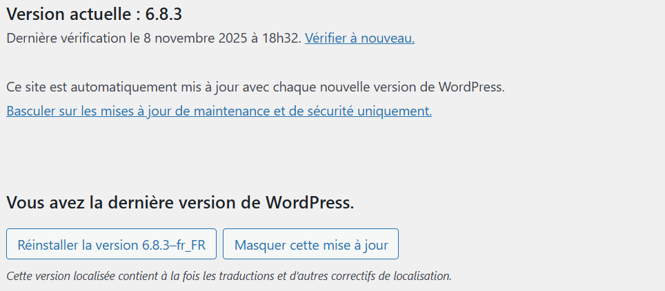

# 🧩 3. Installation de WordPress

## 3.1. Télécharger et extraire WordPress

```bash
cd /var/www/website
wget https://wordpress.org/latest.zip
unzip latest.zip
mv wordpress/* .
rm -rf wordpress latest.zip
```

## 3.2. Configurer WordPress
```bash
cp wp-config-sample.php wp-config.php
nano wp-config.php
```

Modifiez :
```bash
define( 'DB_NAME', 'wordpress' );
define( 'DB_USER', 'wp_user' );
define( 'DB_PASSWORD', 'mot_de_passe' );
define( 'DB_HOST', 'localhost' );
```


## 3.3. Ajuster les permissions

```bash
sudo chown -R www-data:www-data /var/www/monsite
sudo find /var/www/monsite -type d -exec chmod 755 {} \;
sudo find /var/www/monsite -type f -exec chmod 644 {} \;
```
> ⚠️ Attention au niveau des droits accordé avec chmod. N'accordez que les droits necessaire au bon fonctionnement du projet . Exemple 777 à bannir

Redémarrez :

```bash
sudo systemctl restart nginx
```


# 🧩 3. Installation de WordPress

## 3.1. Télécharger et extraire WordPress

On télécharge la dernière version stable de WordPress, on la décompresse, puis on déplace les fichiers à la racine du site.

```bash
cd /var/www/monsite                   # Se placer dans le répertoire du site
wget https://wordpress.org/latest.zip # Télécharge la dernière version de WordPress
unzip latest.zip                      # Décompresse l’archive
mv wordpress/* .                      # Déplace le contenu vers le dossier courant
rm -rf wordpress latest.zip           # Nettoie les fichiers inutiles
```


**💡 Conseils pratiques :**

Toujours vérifier le lien de téléchargement sur le site officiel pour éviter une version compromise.  
Utiliser `wget --secure-protocol=auto` si vous êtes sur un environnement sensible pour forcer le HTTPS sécurisé.

## 3.2. Configuration du fichier principal
Le fichier `wp-config.php` contient toutes les informations de connexion à la base de données.  
On copie le fichier d’exemple fourni par WordPress, puis on le modifie.

```bash
cp wp-config-sample.php wp-config.php   # Copie du fichier modèle
nano wp-config.php                      # Ouverture du fichier dans l’éditeur nano
```

Modifiez les lignes suivantes pour correspondre à vos identifiants de base de données :

```bash
define( 'DB_NAME', 'wordpress' );       # Nom de la base de données
define( 'DB_USER', 'wp_user' );         # Utilisateur MySQL créé précédemment
define( 'DB_PASSWORD', 'mot_de_passe' );# Mot de passe de cet utilisateur
define( 'DB_HOST', 'localhost' );       # Hôte de la base (souvent localhost)
```

## 3.3. Ajuster les permissions et la propriété
WordPress doit pouvoir lire et écrire certains fichiers `(uploads, plugins, thèmes)`.
Cependant, une mauvaise gestion des permissions peut ouvrir des failles de sécurité.

```bash
# Donne la propriété à l’utilisateur utilisé par Nginx
sudo chown -R www-data:www-data /var/www/monsite

# Attribue les bonnes permissions aux dossiers
sudo find /var/www/monsite -type d -exec chmod 755 {} \;

# Attribue les bonnes permissions aux fichiers
sudo find /var/www/monsite -type f -exec chmod 644 {} \;
```

### ⚠️ Attention :

N’utilisez jamais **chmod 777**, cela donne un accès total en écriture et peut être exploité.  
**755** = lecture/exécution pour tous, écriture uniquement pour le propriétaire.  
**644** = lecture pour tous, écriture uniquement pour le propriétaire.  

## 3.4. Redémarrer les services
Une fois la configuration terminée, on redémarre **Nginx** pour appliquer les changements :

```bash
sudo systemctl restart nginx
```
💡 Astuce :
Redémarrer le service pour libérer le cache :

```bash
sudo systemctl restart php8.3-fpm
```

## 3.5. Accéder à WordPress via le navigateur
**Une fois toutes les étapes effectuées, ouvrez votre navigateur et accédez à :
👉 http://<IP_PUBLIQUE> ou, si vous avez configuré votre domaine, 👉 https://votre-domaine.fr**

<br>



## 3.6. Bonnes pratiques de sécurité WordPress
Pour aller plus loin dans la sécurisation :

🚫 Supprimer le fichier readme.html à la racine du site (informations sensibles)  
🔐 Modifier le préfixe des tables dans wp-config.php ($table_prefix = 'wp_'; → autre valeur)  
🧱 Installer un plugin de sécurité (ex : Wordfence, iThemes Security, All in One WP Security)  
🚪 Changer l’URL de connexion (ex : /wp-login.php → /connexion)  
🧯 Configurer un pare-feu applicatif (WAF) ou utiliser un proxy sécurisé (Cloudflare)  
💾 Mettre en place des sauvegardes automatiques régulières  
🧩 Tenir à jour le noyau WordPress, les plugins et les thèmes  