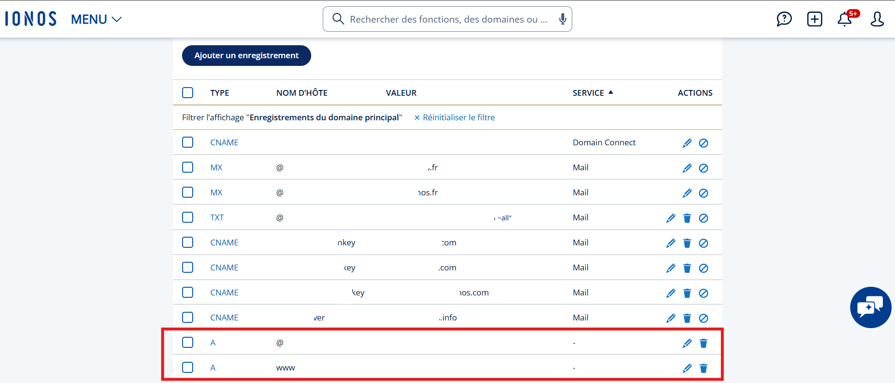
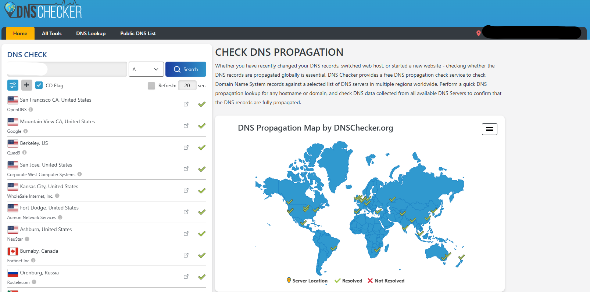
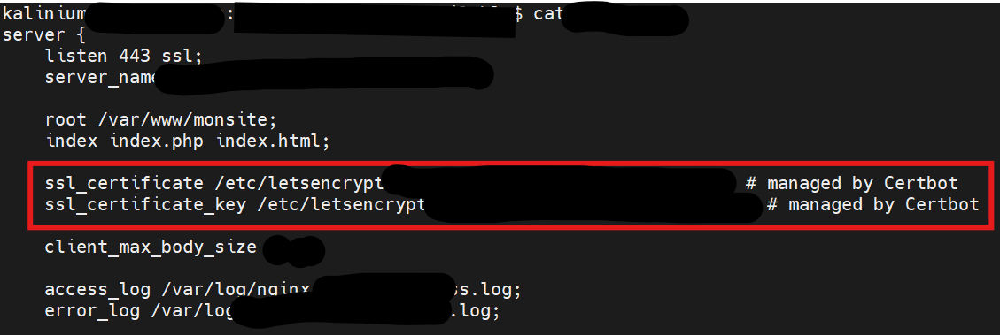
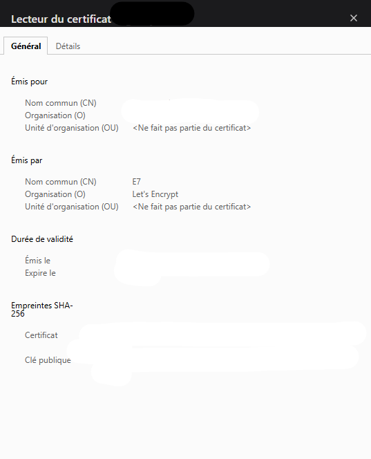

# 🔒 4. Configuration du DNS, HTTPS et Certbot

## 4.1. Configurer le DNS sur IONOS

1. Accédez à votre domaine dans **IONOS > Domaine > Entrées DNS**
2. Modifiez les entrées :
   - `@` → IP publique du VPS
   - `www` → IP publique du VPS

Attendez la propagation DNS (~30 min).

> 💡 L'exemple ici est pour le registrar IONOS mais le principe reste le même pour ses concurents. 

---




>💡 Astuce : La propagation DNS après une modification chez le registrar peut prendre plusieurs heures.
Pour vérifier que la configuration est bien prise en compte à l’échelle mondiale, vous pouvez utiliser un outil comme **dnschecker.org**
 ou **whatsmydns.net**



## 4.2. Installer Certbot

```bash
sudo apt install certbot python3-certbot-nginx -y
```

## 4.3. Générer le certificat SSL

```bash
sudo certbot --nginx -d xxx.fr -d www.xxx.fr
```

Certbot ajoute automatiquement la configuration SSL au fichier Nginx :

**ssl_certificate /etc/letsencrypt/live/xxx.fr/fullchain.pem;**  
**ssl_certificate_key /etc/letsencrypt/live/xxx.fr/privkey.pem;**



## 4.4. Forcer la redirection HTTPS

Ajoutez ce bloc avant le server { listen 443 ssl; ... } :

```python
server {
    listen 80;
    server_name xxx.fr www.xxx.fr;
    return 301 https://$host$request_uri;
}
```

## 4.5. Vérifier le certificat

```bash
sudo nginx -t
sudo systemctl reload nginx
```

🌐 Testez votre domaine sur https://xxx.fr

